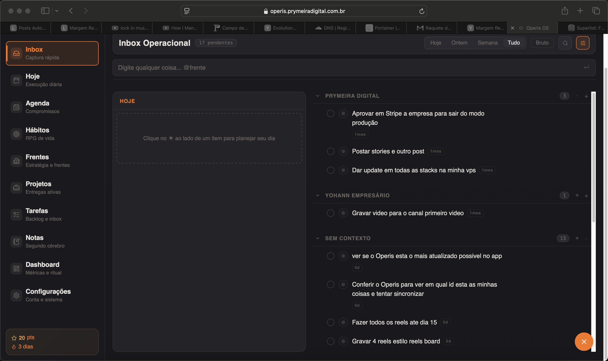
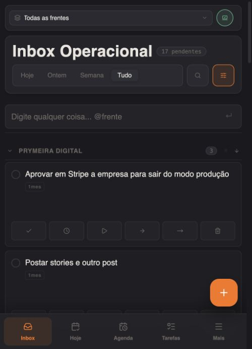
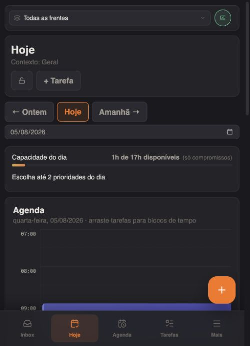
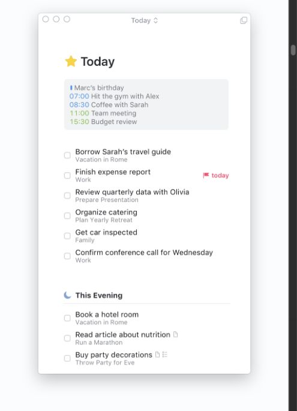
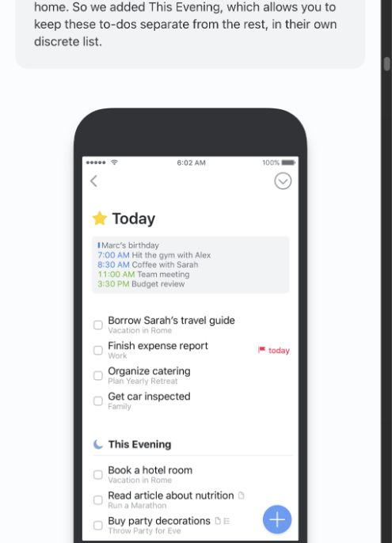
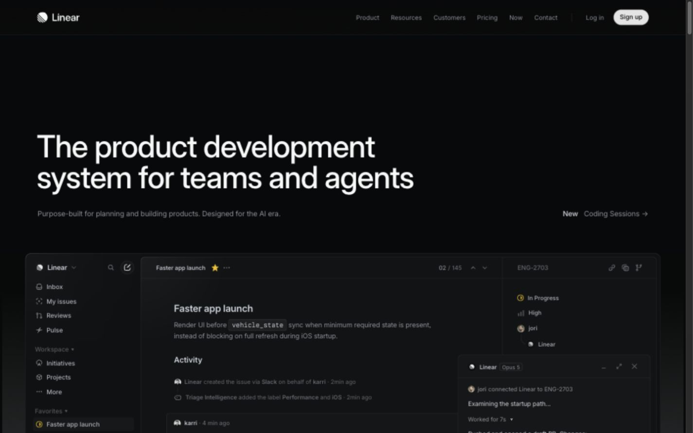
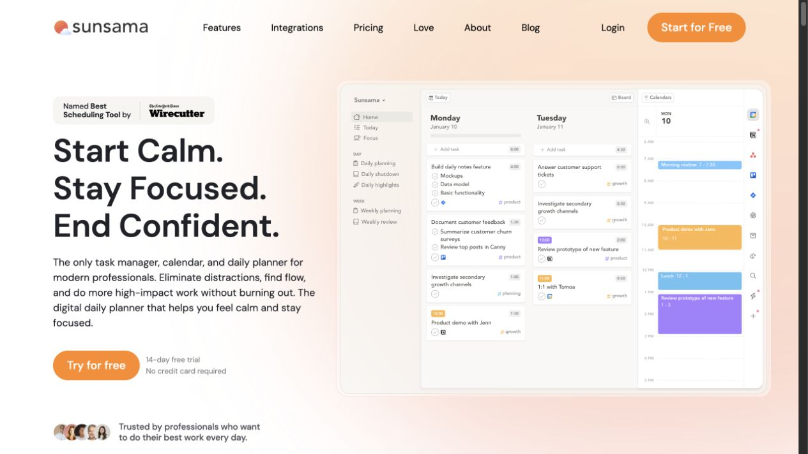
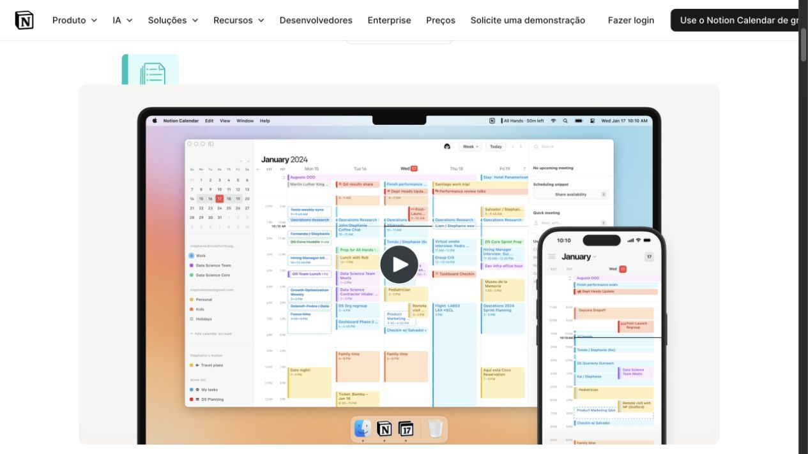

# Operis — Inbox e Hoje unificados

**Data:** 2026-08-05

**Status:** Design aprovado em conversa; aguardando revisão deste documento

**Direção visual:** A — calma e precisão

**Escopo:** primeira etapa da reestruturação de UI/UX do Operis

## 1. Objetivo

Transformar Inbox e Hoje em uma única experiência diária, sem eliminar a diferença útil entre uma captura rápida e uma tarefa complexa.

O Operis deve abrir num espaço que permita:

1. capturar qualquer coisa sem burocracia;
2. decidir o que será executado hoje;
3. enxergar compromissos sem ser dominado pelo calendário;
4. executar itens rápidos e tarefas complexas na mesma lista;
5. revisar conscientemente o que ficou pendente.

O aplicativo já funciona. Esta etapa reorganiza a experiência e preserva os dados e capacidades existentes.

## 2. Relação com especificações anteriores

Este documento substitui a seção **Modo Hoje** de `2026-04-20-inbox-aguardando-hoje-design.md`.

Também substitui, em `2026-03-31-inbox-operacional-design.md`:

- a existência de Inbox e Hoje como entradas independentes da navegação;
- a regra de manter um item simultaneamente visível no Inbox e no painel Hoje;
- o reset destrutivo dos itens do Hoje à meia-noite;
- o layout dividido permanente de 40%/60%;
- a ausência de uma experiência unificada no celular.

As regras de captura, contextos, WhatsApp, Aguardando e conversão em tarefa continuam válidas quando não conflitarem com este documento.

## 3. Diagnóstico visual do estado atual

### 3.1 Inbox no desktop



Problemas observados:

- Inbox e Hoje competem na navegação embora sejam fases do mesmo fluxo.
- O painel Hoje dentro do Inbox duplica a página Hoje sem resolver a relação entre as duas.
- O layout dividido reduz o espaço de leitura e cria uma grande área vazia.
- Há muitos controles persistentes por item.
- Cards, bordas e cabeçalhos repetidos deixam a tela com aparência de painel gerado, não de ferramenta diária.

### 3.2 Inbox no celular



Problemas observados:

- Cada item vira um card alto, com seis ações ocupando uma segunda linha.
- Poucos itens cabem na tela.
- Inbox e Hoje continuam como destinos separados na navegação inferior.
- A captura flutuante funciona, mas compete com ações e navegação.

### 3.3 Hoje no estado atual



Problemas observados:

- A grade de horários é o conteúdo dominante, mesmo quando o usuário quer apenas executar uma lista.
- Data, capacidade e cabeçalho ocupam blocos separados.
- O Pool de execução aceita tarefas estruturadas, mas não capturas rápidas.
- O usuário precisa transformar uma ideia simples em tarefa complexa antes de executá-la nessa página.

## 4. Decisões aprovadas

As decisões abaixo foram validadas uma a uma:

1. **Um item rápido entra em Hoje sem conversão.** Clicar no sol não abre formulário e não exige duração, prioridade ou projeto.
2. **Inbox é uma fila de processamento.** Ao entrar em Hoje, o item sai de “A processar”, mas continua disponível em Tudo/histórico.
3. **Lista primeiro.** A tela diária abre como lista; a grade de horários é um modo de planejamento temporário.
4. **Hoje é a única entrada diária na navegação.** Inbox vira uma bandeja contextual com contador.
5. **Uma lista única.** Itens rápidos e tarefas complexas convivem na mesma sequência.
6. **Revisão consciente.** Pendências de ontem não são carregadas nem descartadas automaticamente; passam por uma revisão curta.
7. **Canvas central com bandeja.** Inbox abre lateralmente no desktop e como folha inferior no celular.

## 5. Referências visuais

As imagens abaixo não servem apenas como inspiração. Cada produto tem uma responsabilidade explícita no design.

### 5.1 Things — lista Hoje, agenda compacta e criação móvel



Decisões extraídas:

- eventos agrupados compactamente no topo;
- tarefas numa lista contínua;
- metadados secundários com baixo contraste;
- separação por espaço e tipografia em vez de cards;
- detalhes avançados aparecem somente quando necessários.



Decisões extraídas para o celular:

- conteúdo ocupa quase toda a largura;
- botão de adicionar permanece fácil de alcançar;
- a estrutura do desktop é preservada sem empilhar painéis;
- ações secundárias não ficam permanentemente abertas.

O Operis não copiará a identidade exclusiva da Apple nem esconderá recursos essenciais sem alternativa acessível.

### 5.2 Linear — shell, hierarquia e densidade



Decisões extraídas:

- barra lateral estreita e silenciosa;
- uma superfície principal contínua;
- hierarquia criada por tipografia, contraste e posição;
- metadados e ações contextuais ficam próximos do objeto;
- tema escuro com poucos contornos e profundidade discreta.

O Operis não copiará a linguagem técnica ou a densidade extrema do Linear.

### 5.3 Sunsama — planejamento como modo contextual



Decisões extraídas:

- tarefas e compromissos podem compartilhar o mesmo dia;
- duração e horário são úteis durante o planejamento;
- o calendário deve apoiar a lista, não substituir a lista.

O Operis não manterá o quadro de colunas e o calendário simultaneamente visíveis durante a execução normal.

### 5.4 Notion Calendar — grade completa no desktop e celular



Decisões extraídas:

- o modo Planejar precisa funcionar no desktop e no celular;
- eventos usam cor para categoria e leitura, não para decoração;
- a grade completa pertence a uma superfície especializada.

O Operis não usará essa grade como página inicial de Hoje.

## 6. Arquitetura da experiência

### 6.1 Navegação

- Remover **Inbox** da barra lateral e da navegação inferior.
- Manter **Hoje** como primeira entrada operacional.
- Exibir `Inbox · n` no cabeçalho de Hoje.
- Preservar `/inbox` como redirecionamento compatível para `/hoje?inbox=open` durante a transição.
- Preservar `/hoje` como rota canônica.

### 6.2 Estrutura da tela Hoje

Ordem padrão:

1. data atual e ações `Inbox · n` e `Planejar`;
2. compromissos compactos;
3. revisão de ontem, somente quando houver pendências;
4. lista única de execução;
5. captura rápida disponível por atalho e ação global.

Não haverá cards independentes para cabeçalho, capacidade, agenda e pool. Esses conteúdos formarão uma superfície contínua.

### 6.3 Desktop

```text
┌──────────────┬─────────────────────────────────────────────┐
│ navegação    │ Quarta, 5 de agosto   Inbox · 17  Planejar │
│ compacta     │ 09:00 Academia · 60 min                    │
│              │─────────────────────────────────────────────│
│ Hoje         │ Pendente de ontem · 3              Revisar │
│ Agenda       │                                             │
│ Hábitos      │ ○ Aprovar empresa no Stripe                │
│ Frentes      │ ○ Construir proposta         Holand · 60m  │
│ Projetos     │ ○ Postar stories                           │
│ Tarefas      │                                             │
│ Notas        │ + Adicionar item                           │
└──────────────┴─────────────────────────────────────────────┘
```

A bandeja do Inbox ocupa uma faixa lateral sobre o canvas, sem redimensionar permanentemente a lista. O modo Planejar pode abrir uma superfície lateral larga ou substituir temporariamente o canvas.

### 6.4 Celular

- Hoje ocupa a tela inteira.
- A navegação inferior não contém Inbox.
- `Inbox · n` abre uma folha inferior expansível.
- A captura rápida usa o botão flutuante e atalho de teclado quando disponível.
- Compromissos ficam numa faixa compacta e rolável.
- Planejar abre em tela cheia.
- Concluir, adiar e devolver ao Inbox podem aparecer por gesto lateral e também em menu acessível.

## 7. Componentes

| Componente | Responsabilidade |
|---|---|
| `TodayWorkspace` | Orquestrar cabeçalho, compromissos, revisão e lista |
| `QuickCapture` | Criar item com título, origem e contexto opcional |
| `InboxTray` | Mostrar somente itens ainda não processados |
| `CompactAgenda` | Exibir compromissos sem carregar a grade completa |
| `TodayExecutionList` | Renderizar e ordenar itens rápidos e tarefas complexas |
| `TodayExecutionRow` | Adaptar metadados mantendo a mesma estrutura visual |
| `RolloverReview` | Decidir destino das pendências de ontem |
| `PlannerMode` | Editar horários, duração e blocos do calendário |

Os componentes devem ter limites claros. A bandeja não conhece a implementação do calendário; a linha de execução não conhece a origem completa do item; o modo Planejar não controla a navegação global.

## 8. Modelo de dados e compatibilidade

### 8.1 Princípio

`InboxItem` e `Task` permanecem como objetos diferentes. Não haverá uma migração que transforme toda captura em tarefa.

Para persistir uma única ordem diária entre fontes diferentes, será criado um contêiner leve de execução:

```prisma
model DailyExecutionItem {
  id          String   @id @default(uuid())
  clerkUserId String   @map("clerk_user_id")
  date        DateTime @db.Date
  sourceType  DailyExecutionSource @map("source_type")
  inboxItemId String?  @map("inbox_item_id")
  taskId      String?  @map("task_id")
  position    Int      @default(0)
  completedAt DateTime? @map("completed_at")
  createdAt   DateTime @default(now()) @map("created_at")

  inboxItem InboxItem? @relation(fields: [inboxItemId], references: [id], onDelete: Cascade)
  task      Task?      @relation(fields: [taskId], references: [id], onDelete: Cascade)

  @@unique([clerkUserId, date, inboxItemId])
  @@unique([clerkUserId, date, taskId])
  @@index([clerkUserId, date, position])
  @@map("daily_execution_items")
}

enum DailyExecutionSource {
  inbox
  task
}
```

Regras de validação do serviço:

- exatamente uma origem deve existir: `inboxItemId` ou `taskId`;
- a origem deve pertencer ao usuário autenticado;
- a mesma origem não pode aparecer duas vezes no mesmo dia;
- posições são normalizadas numa transação após reordenação.

`DayPlanItem` continua responsável pelos blocos com horário. Um item pode estar em Hoje sem possuir bloco de calendário.

### 8.2 Migração do comportamento atual

- Registros atuais de `InboxTodayItem` serão copiados para `DailyExecutionItem` sem alterar `InboxItem`.
- Tarefas atualmente com status `hoje` serão ligadas ao dia atual por backfill idempotente.
- `InboxTodayItem` será mantido durante uma janela de compatibilidade e removido somente após validação.
- `/inbox/today` permanece disponível durante a transição.
- Nenhum `InboxItem`, `Task` ou `DayPlanItem` existente será apagado pela migração.

### 8.3 Representação da interface

```ts
type TodayEntry =
  | {
      kind: 'inbox';
      id: string;
      sourceId: string;
      title: string;
      context?: string;
      completedAt?: string;
    }
  | {
      kind: 'task';
      id: string;
      sourceId: string;
      title: string;
      project?: string;
      estimatedMinutes?: number;
      deadline?: string;
      completedAt?: string;
    };
```

Essa união é uma representação de leitura. Não apaga a diferença entre captura e tarefa.

## 9. Fluxos

### 9.1 Capturar

1. Usuário digita um título.
2. O item é criado como `InboxItem` pendente.
3. A bandeja incrementa o contador.
4. O foco permanece pronto para outra captura.

### 9.2 Mandar item rápido para Hoje

1. Usuário aciona o sol.
2. Um `DailyExecutionItem` com origem `inbox` é criado.
3. O item sai da visão “A processar”.
4. O item entra na lista Hoje sem formulário.
5. Um aviso com **Desfazer** fica disponível por alguns segundos.

No histórico, o `InboxItem` continua existindo e recebe a indicação de que foi planejado para a data.
Enquanto estiver alocado em Hoje, seu status de origem pode continuar `pendente`; a consulta da bandeja exclui itens que já possuem alocação diária ativa. Isso evita alterar o significado histórico de `InboxItem.status`.

### 9.3 Mandar tarefa complexa para Hoje

1. Usuário escolhe Hoje na tarefa ou a puxa pelo modo Planejar.
2. Um `DailyExecutionItem` com origem `task` é criado.
3. A linha mostra apenas os metadados úteis: projeto, duração ou prazo.
4. Agendar horário cria ou atualiza um `DayPlanItem` relacionado à tarefa.

### 9.4 Concluir

- Item rápido: atualiza `DailyExecutionItem.completedAt` e `InboxItem.status = feito`.
- Tarefa complexa: atualiza `DailyExecutionItem.completedAt` e conclui a `Task` pelo serviço existente.
- Desfazer restaura ambos os estados de forma atômica.

### 9.5 Devolver ao Inbox

- Remove a alocação diária.
- Mantém o `InboxItem` como pendente.
- O item reaparece em “A processar”.

Uma tarefa complexa devolvida sai de Hoje, mas permanece em Tarefas no estado coerente com o horizonte atual.

### 9.6 Revisar pendências de ontem

Itens incompletos permanecem ligados à data anterior e aparecem em `RolloverReview` no próximo dia. Se a revisão for ignorada por mais de um dia, eles continuam disponíveis como “Pendentes anteriores”, ordenados da data mais antiga para a mais recente. Para cada item, o usuário escolhe:

- **Manter em Hoje:** move a alocação para a data atual;
- **Voltar ao Inbox:** remove a alocação diária da captura rápida;
- **Concluir:** conclui a origem e a alocação.

O worker não apaga mais automaticamente pendências antigas.

## 10. Estados de erro e sincronização

- Movimentos usam atualização otimista com rollback em caso de falha.
- Criar a mesma alocação duas vezes retorna a existente ou conflito tratável; nunca duplica.
- Reordenação é persistida em transação.
- Falha ao carregar compromissos não bloqueia a lista; `CompactAgenda` mostra estado de erro isolado.
- Falha ao carregar Inbox não bloqueia itens de Hoje já disponíveis.
- Fechar o modo Planejar não descarta alterações confirmadas.
- A interface diferencia claramente concluir, remover de Hoje e excluir a origem.
- Todas as ações destrutivas exigem confirmação ou capacidade imediata de desfazer.

## 11. Linguagem visual

- Tema escuro atual preservado nesta fase, com revisão de contraste.
- Laranja reservado para ação primária, seleção e pequenos estados.
- Cards somente quando um agrupamento realmente precisa de contêiner.
- Linhas da lista entre 44 e 56 px no desktop, com alvo de toque mínimo de 44 px.
- Ações secundárias aparecem no hover, foco, gesto ou menu.
- Animações curtas, entre 150 e 220 ms, respeitando `prefers-reduced-motion`.
- Tipografia e espaçamento criam a hierarquia principal.

## 12. Acessibilidade

- Todos os gestos possuem alternativa por botão/menu.
- Ordem de tabulação segue a ordem visual.
- Bandeja e modo Planejar controlam foco ao abrir e restauram foco ao fechar.
- Estados não dependem somente de cor.
- Contadores possuem rótulos acessíveis.
- Reordenação por teclado é suportada ou acompanhada por comandos mover acima/abaixo.

## 13. Verificação

### Funcional

- captura rápida cria item no Inbox;
- sol move para Hoje sem conversão;
- item planejado sai de “A processar” e permanece em Tudo;
- tarefa complexa e item rápido aparecem na mesma lista;
- reordenação entre tipos persiste;
- conclusão e desfazer sincronizam origem e alocação;
- revisão de ontem oferece os três destinos aprovados;
- calendário continua agendando tarefas complexas;
- links antigos de Inbox continuam funcionando via redirecionamento.

### Visual e responsiva

- validar 1440×900, 1280×800, 768×1024, 390×844 e 360×800;
- lista permanece protagonista em todos os tamanhos;
- bandeja não comprime permanentemente o canvas;
- não há rolagem horizontal na tela principal;
- controles não se sobrepõem à navegação inferior;
- estados vazio, carregando, erro e grande volume são revisados visualmente.

### Regressão

- contextos do Inbox;
- itens originados do WhatsApp;
- Aguardando;
- conversão em tarefa;
- conclusão de tarefas;
- compromissos e blocos fixos;
- autenticação e isolamento por usuário.

## 14. Fora do escopo

- redesign completo de Agenda, Hábitos, Frentes, Projetos, Tarefas, Notas ou Dashboard;
- substituição global da identidade visual;
- automação por IA para decidir o dia sem confirmação;
- transformação automática de captura rápida em tarefa;
- sincronização com novos provedores de calendário;
- novas regras de gamificação.

## 15. Critérios de sucesso

O design será considerado bem-sucedido quando:

- o usuário puder capturar e mandar algo para Hoje em segundos;
- a tela inicial mostrar o plano do dia, não uma grade vazia;
- Inbox e Hoje não parecerem produtos separados;
- itens rápidos não exigirem metadados de tarefa complexa;
- mais conteúdo útil couber na tela, especialmente no celular;
- o aplicativo preservar todas as informações existentes;
- as referências visuais forem reconhecíveis nas decisões, sem o Operis virar uma cópia de outro produto.
